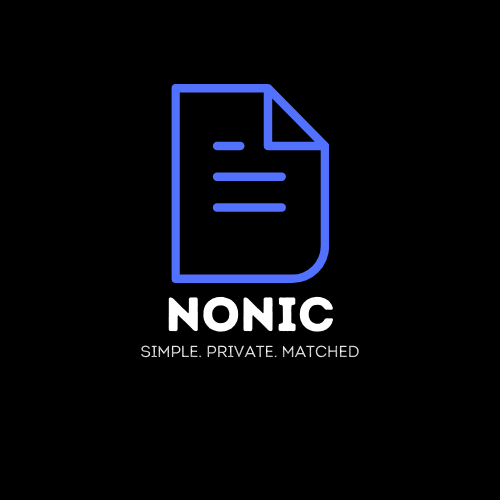

<p align="center">

  <h3 align="center">Nonic</h3>

  <p align="center">
    <!-- <a></a> -->
    <br />
    Write anything, only for you with unmatched customizations and self hosting.
    <br />
  </p>
</p>

## Introduction

Students, Business professionals, Software developers, etc. regularly take notes and are dependent on various notes applications to store their notes safely.

Human brain is already occupied by thousand things and having different notebooks, apps to store, manage and share these things, leave out the part where you actually own it, it’s a very hectic process.

This is where Nonic comes to play. A simple self-hosted note taker application where you own your data, can share it between devices and customize it according to your style.

## One click Deploy

[](https://vercel.com/new/clone?repository-url=https%3A%2F%2Fgithub.com%2FJashnm%2Fnonic&env=MONGODB_URI,NEXT_PUBLIC_BASE_URL,JWT_SECRET_KEY,CIPHR_KEY,MY_SECRET,NEXT_PUBLIC_CLOUDINARY_UPLOAD_PRESET,NEXT_PUBLIC_CLOUDINARY_NAME)

## Development

1. Install dependencies

```bash
Yarn
# or
npm i
```

2. Add Environment variables -

```bash
MONGODB_URI= # Add your MongoDB databse URI
NEXT_PUBLIC_BASE_URL=http://localhost:3000 # Add you domain or deployment URL after deployment is done
JWT_SECRET_KEY= # JWT secret key for auth purposes
CIPHR_KEY= # Any string which will be part of the key to encrypt your notes
MY_SECRET= # Any code/password to reset your pin. Never reveal this to anyone
NEXT_PUBLIC_CLOUDINARY_UPLOAD_PRESET= # Cloudinary upload preset if want to upload local images in notes
NEXT_PUBLIC_CLOUDINARY_NAME= # Cloudinary name for the same above reason
```

3. Open [http://localhost:3000](http://localhost:3000) with your browser to see the result.
